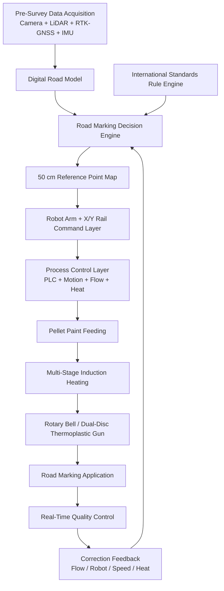

# 1. Sistem Genel Akışı

<a href="../02-pellet-paint-system/">Git: Pellet Boya Sistemi</a><a href="../03-induction-heating-system/">Git: İndüksiyon Isıtma</a><a href="../04-next-generation-thermoplastic-gun/">Git: Termoplastik Tabanca</a><a href="../08-rmde-software-architecture/">Git: RMDE</a><a href="../11-international-standards-engine/">Git: Standartlar</a>

## Sistem Akışının Amacı

Bu bölüm, platformun nasıl ölçtüğünü, karar verdiğini, fiziksel uygulamayı nasıl yürüttüğünü ve uygulama kalitesini nasıl geri beslediğini açıklar. Ana mantık, beş teknik dokümanı tek bir proses zinciri olarak bağlamaktır.

## Entegrasyon Prensibi

Sistem, tek başına çalışan parçalar toplamı değildir. Bütün alt sistemler aynı görevi yerine getirmek için veri paylaşır:

| Katman | İşlev | Bağlandığı Modüller |
|---|---|---|
| Veri toplama | Yol geometrisi, mevcut çizgi, yüzey ve konum bilgisi toplar | RMDE, standart motoru, kalite kontrol |
| Karar motoru | Çizgi tipi, ölçü, renk, konum, hız ve akış kararlarını üretir | 50 cm referans noktaları, robot, HUD, PLC |
| Proses kontrol | Boya akışı, sıcaklık, basınç, valf, pompa ve güvenliği yönetir | PLC, indüksiyon, tabanca, sensörler |
| Robotik uygulama | Uygulama ucunu doğru koordinata taşır | RMDE, robot komut katmanı, HUD, kalite kontrol |
| Kalite kontrol | Uygulama sonucunu ölçer ve düzeltme önerir | Kamera, lazer profil sensörü, AI kalite modülü |
| Standart motoru | Ülke ve senaryo bazlı çizgi kurallarını sağlar | RMDE, kalite kontrol, raporlama |

## Git Kısa Yol Mantığı

Her modül sayfası, diğer ilgili modüllere bağlanır. Bu sayede tasarımcı, örneğin “tabanca” sayfasından doğrudan “indüksiyon”, “robot”, “PLC”, “BOM” ve “yazılım dosyaları” sayfalarına geçebilir.
