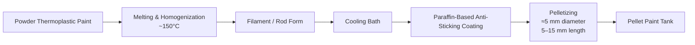

# 2. Pellet Boya Sistemi

<a href="../12-prototype-bom/#paint-transfer-and-flow">Git: Vida Pompa / BOM</a><a href="../03-induction-heating-system/">Git: İndüksiyon Isıtma</a><a href="../07-plc-control-system/">Git: PLC Kontrol</a><a href="../software/plc_process_interface.py">Git: Yazılım: plc_process_interface.py</a>

## Sistem Tanımı

Pellet boya sistemi, termoplastik boyanın toz veya blok form yerine kontrollü, homojen ve akış davranışı daha öngörülebilir granül formda sisteme beslenmesini sağlar. Amaç, vida pompa ve indüksiyon hattında sürekli ve kararlı malzeme transferidir.

## Pellet Üretim Süreci

## Teknik Gerekçe

Toz boya doğrudan vida / pompa hattına beslendiğinde köprülenme, düzensiz kütlesel akış, lokal aşırı ısınma, basınç dalgalanması ve kalite bozulması oluşturabilir. Pellet form ise şu avantajları sağlar:

- daha homojen yoğunluk,
- kontrollü geometri,
- daha stabil akış,
- daha öngörülebilir ısı transferi,
- daha düşük tıkanma riski,
- daha kararlı debi ve basınç kontrolü.

## Donanım Bağlantıları

| Bileşen | Görev | Bağlandığı Sistem |
|---|---|---|
| Pellet boya tankı | 4000 kg seviyesinde pellet depolama | Vida besleme, şasi, nem kontrolü |
| Düşük hızlı karıştırıcı | Köprülenme ve düzensiz beslemeyi azaltma | PLC, motor sürücü, tank sensörleri |
| Vida pompa / screw feeder | Kontrollü boya transferi | Akış sensörü, basınç sensörü, indüksiyon hattı |
| Nem kontrolü | Pellet topaklanmasını azaltma | Tank havalandırma, kurutucu, servis kapağı |
| Seviye sensörleri | Malzeme seviyesini takip etme | PLC, HMI, alarm sistemi |

## PLC ve Sensör İhtiyaçları

- tank seviye sensörü,
- karıştırıcı motor akım izleme,
- vida pompa motor hız geri bildirimi,
- vida çıkış basınç sensörü,
- akış / debi tahmin değeri,
- tıkanma / aşırı basınç alarmı,
- hat purge modu durumu.

## Entegrasyon Notu

Pellet sistemi tek başına malzeme deposu değildir. Induction heating, paint transfer, PLC flow control, robot application ve quality feedback sistemlerinin ilk fiziksel girdisidir.
