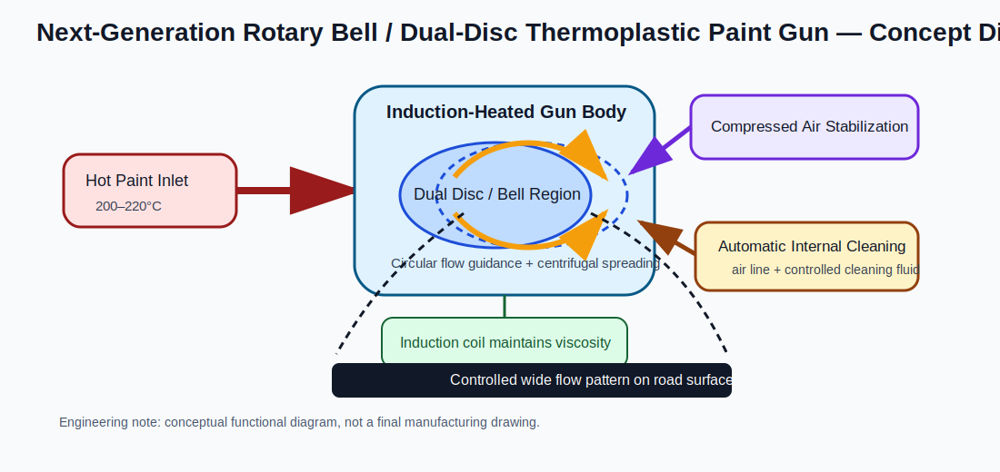
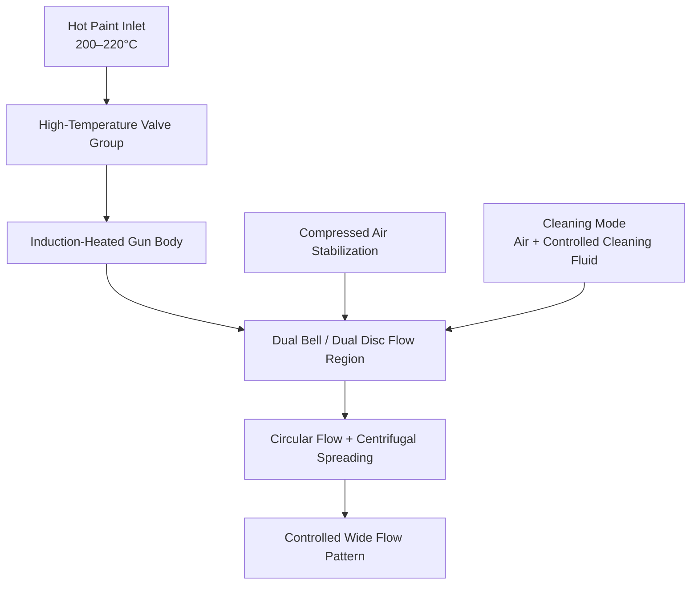

# 4. Yeni Nesil Termoplastik Boya Tabancası

<a href="../05-robot-arm-xy-rail/">Git: Robot Kol + X/Y Kızak</a><a href="../03-induction-heating-system/">Git: İndüksiyon Isıtma</a><a href="../07-plc-control-system/">Git: PLC Kontrol</a><a href="../12-prototype-bom/#application-end-effector">Git: BOM: Application End Effector</a><a href="../software/robot_command_layer.py">Git: Yazılım: robot_command_layer.py</a><a href="../software/plc_process_interface.py">Git: Yazılım: plc_process_interface.py</a>

## Ana Tanım

Yeni nesil termoplastik boya tabancası, klasik ince delikli fan-nozzle yapısına alternatif olarak **rotary bell / dual-disc** prensibine dayalı bir uygulama ucudur. Amaç, yüksek sıcaklıktaki termoplastik boyayı dar bir delikten zorlamak değil; daha geniş, daha kontrollü ve tıkanma riski daha düşük bir akış geometrisi oluşturmaktır.

## Çalışma Prensibi

## Temel Alt Sistemler

| Alt Sistem | İşlev |
|---|---|
| Hot paint inlet | İndüksiyon hattından gelen 200–220°C boyayı alır |
| Yüksek sıcaklık valf grubu | aç/kapa ve debi geçişini yönetir |
| Induction-heated body | viskoziteyi korur, donma riskini azaltır |
| Dual-disc / dual-bell akış bölgesi | boya akışını dönel ve geniş geometriye yayar |
| Basınçlı hava stabilizasyonu | akış kenarlarını ve püskürtme karakterini destekler |
| Otomatik iç temizlik | bekleme ve kapanışta kalıntı birikmesini azaltır |
| Sıcaklık ve basınç sensörleri | PLC kapalı çevrim kontrolüne veri sağlar |
| Robot bağlantı flanşı | robot bileğine / end-effector yapısına bağlanır |

## Tıkanma Direnci

Sistemin temel avantajı ince çıkış deliklerine bağımlı olmamasıdır. Geniş akış geçişleri ve fan/bell bölgeleri sayesinde küçük partiküller dar deliklerde sıkışmak yerine akış yolunda ilerleyebilir. Bu özellikle yüksek dolgu oranına sahip termoplastik boyalarda önemlidir.

## Induction-Assisted Temperature Maintenance

Tabanca gövdesi çevresel indüksiyon bobinleriyle ısıtılır. Bu sayede:

- viskozite daha sabit tutulur,
- uç noktada sıcaklık kaybı azalır,
- donma ve sertleşme riski düşer,
- ilk püskürtme kalitesi iyileşir.

## Otomatik İç Temizlik

Kapanış veya uzun bekleme modunda özel cleaning mode çalışır. Temizlik akışı boya akış yolunu takip eder ve şu bölgeleri temizler:

- iki bell/disc arasındaki akış bölgesi,
- fan kanatları,
- hava kanalları,
- boya transfer yüzeyleri.

## Robot Kol Entegrasyonu

Tabanca sabit açılı kör bir uç olmamalıdır. Robot kol ve/veya mikro ray sistemi, nozzle/bell yüksekliğini ve açı düzeltmesini gerçek zamanlı yönetmelidir.

Bağlantılı kontrol verileri:

- robot hedef koordinatı,
- nozzle/road surface mesafesi,
- sıcaklık,
- basınç,
- boya debisi,
- cam küreciği senkronizasyonu,
- kalite kontrol geri bildirimi.

## Bakım ve Sökme Mantığı

- hızlı sökülebilir end-effector bağlantısı,
- termal izolasyon plakası,
- valf ve sensörlere servis erişimi,
- cleaning/drainage portları,
- aşınmaya dayanıklı metal malzeme,
- hardened alloy steel / wear-resistant material yaklaşımı.
