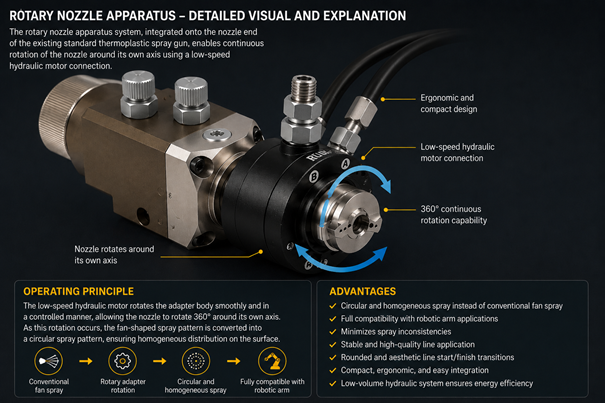

[04-next-generation-thermoplastic-gun.md](https://github.com/user-attachments/files/28955412/04-next-generation-thermoplastic-gun.md)
# 04 — Next-Generation Thermoplastic Paint Gun

<div class="git-buttons">

[Git: Sistem Genel Akışı](01-system-flow.md)
[Git: Pellet Boya Sistemi](02-pellet-paint-system.md)
[Git: İndüksiyon Isıtma Sistemi](03-induction-heating-system.md)
[Git: Robot Kol + X/Y Kızak](05-robot-arm-xy-rail.md)
[Git: PLC ve Kontrol Sistemi](07-plc-control-system.md)
[Git: RMDE Yazılım Mimarisi](08-rmde-software-architecture.md)
[Git: Kalite Kontrol Sistemi](10-quality-control-system.md)
[Git: Prototip BOM](12-prototype-bom.md)
[Git: Yazılım Dosyaları](13-software-files.md)

</div>

---

## 1. Modülün Sistemdeki Rolü

Yeni nesil termoplastik boya tabancası, ROMR platformunun **uygulama uç elemanı**dır. Bu modül, pellet boya sistemi, indüksiyon ısıtma hattı, PLC kontrol sistemi, robot kol ve RMDE yazılım mimarisi arasında fiziksel uygulamayı gerçekleştiren son katmandır.

Bu tabanca klasik fan tipi dar nozul mantığıyla çalışmaz. Sistemin amacı, yüksek sıcaklıktaki termoplastik boyayı dar bir delikten zorlayarak yelpaze şeklinde püskürtmek yerine; **dönel hareket, santrifüj kuvvet, geniş akış geçitleri, çift bell / çift disk yapısı ve hava destekli akış stabilizasyonu** ile daha homojen, tıkanmaya dirençli ve robotik uygulamaya uygun bir püskürtme geometrisi oluşturmaktır.

---

## 2. Temel Çalışma Prensibi

Tabanca sistemi şu ana prensip üzerine kuruludur:

```text
Pellet boya besleme sistemi
↓
Screw pump / kontrollü boya transferi
↓
İndüksiyon ısıtmalı transfer hattı
↓
Isıtmalı tabanca gövdesi
↓
Sabit iç bell
↓
Dönen dış bell
↓
Fan kanatları ve 45° hava kanalları
↓
Dairesel ve homojen boya püskürtme
↓
Asfalt üzerinde standartlara uygun çizgi oluşumu
```

Sistemde termoplastik boya ana gövdeye sol taraftan girer. Boya, gövde içinde sıcaklığı korunarak ilerler ve sabit iç bell ile dönen dış bell arasındaki kontrollü akış bölgesine ulaşır. Dönen dış bell üzerindeki fan kanatları boyaya açısal momentum kazandırır. İç bell üzerinde bulunan yaklaşık 45° açılı hava kanalları ise bu dönel hareketi stabilize eder.

Bu yapı sayesinde boya yalnızca doğrusal basınçla değil; aynı zamanda **radyal ve teğetsel hareket bileşenleriyle** yüzeye aktarılır.

---

## 3. Teknik Görseller

### 3.1 Hidrolik Tork Destekli — İndüksiyon Isıtmalı Rotary Bell Nozul


Bu görselde sistemin ana akış mantığı gösterilir:

- Boya sol taraftan ana gövdeye girer.
- Hava alt taraftan sisteme girer.
- Hidrolik sistem dış bell ve iç bileşenlerin çalışma stabilitesini destekler.
- İndüksiyon bobinleri dış gövdeyi ısıtır.
- Boya iki bell arasından geçerken döner, atomize olur ve dairesel püskürtme örüntüsü oluşturur.

### 3.2 Alternatif Rotary Nozzle Apparatus Görseli



Bu ikinci görsel, mevcut termoplastik tabanca ucuna entegre edilebilecek alternatif rotary nozzle apparatus yaklaşımını temsil eder. Bu yaklaşım, ana çift bell hedef teknolojisine geçişte daha hızlı prototiplenebilecek bir ara çözüm olarak değerlendirilebilir.

---

## 4. Ana Mekanik Alt Sistemler

| Alt Sistem | Görev |
|---|---|
| Isıtmalı ana gövde | Boyanın tabanca girişinde sıcaklığını korur |
| Sabit iç bell | Hava kanallarını ve akış yönlendirme yüzeylerini taşır |
| Dönen dış bell | Boyaya dönel hareket ve açısal momentum kazandırır |
| Fan kanatları | Boyanın çevresel hareketini güçlendirir |
| 45° hava kanalları | Dairesel püskürtme örüntüsünü stabilize eder |
| Hidrolik tork destekli tahrik | Dönen dış bell için düşük devirli, yüksek torklu hareket sağlar |
| İndüksiyon ısıtma bölgesi | Gövde sıcaklığını korur ve boya viskozitesini dengeler |
| Otomatik temizlik kanalı | Çalışma sonrasında iç akış yollarını temizler |
| Robot bilek bağlantısı | 6 eksenli robot kola end-effector olarak bağlanır |
| Emiş / toz toplama bağlantısı | Püskürtme sırasında oluşan boya tozunu toplama sistemine aktarır |

---

## 5. Rotary Bell / Dual-Bell Akış Mimarisi

Sistemin ana farkı, püskürtme geometrisinin dar nozul delikleriyle değil, **akış fiziğiyle** oluşturulmasıdır.

Klasik sistemlerde boya yüksek basınç altında dar deliklerden geçerken şu sorunlar oluşabilir:

- nozul aşınması,
- kısmi tıkanma,
- püskürtme geometrisinin bozulması,
- homojenlik kaybı,
- çizgi merkezinde veya kenarlarında kalınlık dalgalanması.

Yeni sistemde püskürtme karakteristiği şu parametrelerin birleşimiyle oluşur:

- açısal momentum,
- santrifüj kuvvet,
- hava momentumu,
- akış yönlendirici yüzeyler,
- dönel bell geometrisi,
- geniş akış geçitleri.

Bu nedenle sistem yüksek dolgulu, yüksek viskoziteli, mineral katkılı termoplastik boyalarda daha kararlı çalışma hedefler.

---

## 6. Robotik Uygulama Avantajı

Tabanca 6 eksenli robot kolun ucuna entegre edilecek şekilde tasarlanır. Robot kol, şasi üzerindeki raylar sayesinde ileri-geri ve sağ-sol hareket kabiliyetine sahip olacaktır.

Robotik avantajlar:

- tabanca yüksekliği sabit tutulur,
- robot açısı değişse bile dairesel püskürtme geometrisi korunur,
- sağ-sol ve ileri-geri manevralarda çizgi hassasiyeti daha stabil kalır,
- klasik yelpaze püskürtmede görülen açı kaynaklı dağılım bozulmaları azalır,
- RMDE tarafından üretilen koordinat komutları daha kararlı uygulanır,
- farklı ülke standartlarına göre çizgi eni ve kalınlık değişimleri daha kontrollü uygulanır.

Robot kol ve lineer kızak sistemi tabancayı yalnızca taşıyan mekanik eleman değildir. Bu sistem RMDE, PLC, kalite kontrol ve standart motoru ile kapalı döngü çalışan bir uygulama katmanıdır.

---

## 7. Sabit Yükseklik ve Titreşim/Darbe İzolasyonu

Uygulama sırasında tabancanın asfalt yüzeyinden yüksekliği sabit tutulmalıdır. Bu nedenle sistemde aşağıdaki mühendislik prensipleri uygulanmalıdır:

- robot kol üzerinden kontrollü yükseklik pozisyonlama,
- nozzle/gun height sensor ile sürekli yükseklik kontrolü,
- şasi titreşimlerini azaltan mekanik bağlantı,
- robot bileğinde titreşim sönümleyici bağlantı,
- darbe anında tabancayı koruyan esnek / kontrollü kaçış mekanizması,
- PLC üzerinden titreşim, ani yük ve yükseklik sapması alarmı,
- RMDE ve kalite kontrol modülü ile çizgi geometrisi geri bildirimi.

Tabanca ucundaki döner nozul yapısı, yelpaze tipi tek eksenli püskürtmeden farklı olarak dairesel karakterli dağılım verdiği için robot hareketlerinde çizgi hassasiyetinin korunmasına yardımcı olur.

---

## 8. Boya Tozu Emiş ve Toplama Sistemi

Püskürtme sırasında oluşabilecek boya tozları veya ince partiküller robot kola entegre edilecek emiş hortumu ve yüksek emiş gücüne sahip jet fan sistemi ile toplanacaktır.

```text
Tabanca püskürtme bölgesi
↓
Robot kola entegre emiş ağzı
↓
Esnek emiş hortumu
↓
Yüksek emiş gücüne sahip jet fanlar
↓
Kamyon altında bulunan toz haznesi
↓
Bakım / boşaltma noktası
```

Bu sistemin hedefleri:

- çalışma alanında boya tozu birikimini azaltmak,
- robot kol ve sensörlerin kirlenmesini azaltmak,
- operatör ve çevre güvenliğini artırmak,
- kalite kontrol kameralarının görüşünü korumak,
- tabanca etrafında daha temiz bir uygulama bölgesi oluşturmak.

---

## 9. İndüksiyon Isıtma ve Viskozite Stabilitesi

Tabanca gövdesi çevresel olarak indüksiyon bobinleriyle ısıtılır. Bu yapı sayesinde:

- boya viskozitesi sabit tutulur,
- sıcaklık kaybı azaltılır,
- tabanca girişinde donma / sertleşme riski düşer,
- püskürtme sürekliliği korunur,
- rotary bell bölgesinde akış kararlılığı artar.

Tabanca ısıtma kontrolü PLC tarafından yönetilmelidir. Isıtma modülü, indüksiyon hattının son bölgesiyle eş zamanlı çalışmalı ve boya sıcaklığı tabanca çıkışına kadar korunmalıdır.

---

## 10. Hidrolik Tork Destekli Tahrik ve Devir Kontrolü

Dönen dış bell için düşük hızlı hidrolik tahrik sistemi öngörülür. Bu tahrik sistemi yüksek sıcaklık çevresinde çalışabilecek, yüksek tork sağlayabilecek ve devir ayarı yapılabilecek şekilde tasarlanmalıdır.

Başlangıç prototip referansı:

| Parametre | Referans |
|---|---|
| Tahrik tipi | Düşük devirli hidrolik motor |
| Kontrol | PLC izlemeli hız kontrolü |
| İlk prototip hız aralığı | yaklaşık 100–500 RPM |
| Ayar yöntemi | Operatör veya otomasyon sistemi |
| Görev | Açısal momentum ve püskürtme stabilitesi kontrolü |

Dönüş hızı; boya sıcaklığı, viskozite, debi, çizgi genişliği ve robot hareket hızına göre optimize edilmelidir.

---

## 11. Otomatik İç Temizlik Sistemi

Tabanca yalnızca uygulama performansı için değil, bakım verimliliği için de tasarlanmalıdır. Çalışma bitiminde veya uzun bekleme sürelerinde otomatik temizlik modu devreye alınır.

Temizlik süreci:

```text
Uygulama sonu
↓
Boya akışı durdurulur
↓
Temizlik modu aktif edilir
↓
Hava hattından kontrollü temizlik akışı başlatılır
↓
Dizel yakıt / uygun temizlik sıvısı sisteme verilir
↓
Sıvı boya ile aynı akış yolunu takip eder
↓
Bell arası bölge, fan kanatları, hava kanalları ve transfer yüzeyleri temizlenir
↓
Dış bell dönüşü temizlik sıvısını çevresel olarak dağıtır
↓
Sistem bir sonraki uygulama döngüsüne hazırlanır
```

Temizlik sisteminin hedefleri:

- içeride boya sertleşmesini azaltmak,
- ilk püskürtme kalitesini korumak,
- manuel temizlik ihtiyacını azaltmak,
- bakım süresini kısaltmak,
- field operation sürekliliğini artırmak.

---

## 12. Malzeme Seçimi ve Dayanıklılık

Tabanca yüksek sıcaklıkta, mineral dolgulu, pigmentli, reçineli ve aşındırıcı termoplastik boya ile temas edecektir. Bu nedenle özellikle inner bell ve outer bell malzeme seçimi kritik önemdedir.

Önerilen malzeme grupları:

- sertleştirilmiş takım çelikleri,
- ısıl işlem görmüş paslanmaz çelikler,
- nitrürlenmiş özel alaşımlı çelikler,
- tungsten karbür kaplamalı aşınma yüzeyleri,
- seramik kaplamalı iç akış yüzeyleri.

Dönen dış bell için gerekli özellikler:

- yüksek sertlik,
- düşük yüzey pürüzlülüğü,
- iyi dinamik balans kabiliyeti,
- yüksek sıcaklıkta boyutsal stabilite,
- aşınmaya dayanıklı kaplama.

Sabit iç bell için gerekli özellikler:

- yüksek sıcaklık dayanımı,
- hassas işlenebilirlik,
- hava kanallarında deformasyon direnci,
- boya birikimine karşı düşük yüzey tutunması,
- kolay temizlenebilir yüzey kalitesi.

Rulman, destek ve sızdırmazlık elemanlarında:

- yüksek sıcaklık rulmanları,
- ısıya dayanıklı keçeler,
- grafit veya PTFE bazlı sızdırmazlık elemanları,
- yüksek sıcaklık endüstriyel gresler

kullanılmalıdır.

---

## 13. Bakım, Sökme ve Servis Erişimi

Tabanca modüler ve servis erişilebilir olmalıdır. Aşağıdaki parçalar bağımsız sökülebilir tasarlanmalıdır:

- dönen dış bell,
- sabit iç bell,
- fan kanatlı rotary assembly,
- hava yönlendirme parçaları,
- rulman ve destek sistemi,
- hidrolik tahrik bağlantıları,
- indüksiyon ısıtmalı gövde bölümleri,
- emiş hortumu bağlantısı,
- robot bilek bağlantı aparatı.

Bakım avantajları:

- bell arası akış bölgesi temizlenebilir,
- fan kanatları kontrol edilebilir,
- hava kanalları servis edilebilir,
- rulman ve destek elemanları değiştirilebilir,
- aşınan yüzeyler sahada yenilenebilir,
- ince nozul delikleri olmadığı için klasik hassas nozul temizliği büyük ölçüde azalır.

---

## 14. Standart Kütüphanesi ile Entegrasyon

Çizgi eni, et kalınlığı, çizgi tipi ve renk bilgisi ülkeye göre sistem tarafından standart kütüphanesinden alınmalıdır.

Operatörün yapması gereken işlem:

```text
Country / Region selection
↓
Standard library loads line rules
↓
RMDE calculates line geometry
↓
Robot command layer positions the gun
↓
PLC adjusts flow, temperature, air and rotation
↓
Quality system verifies final marking
```

Bu sayede:

- çizgi eni,
- çizgi kalınlığı,
- çizgi uzunluğu,
- boşluk mesafesi,
- renk,
- cam küreciği miktarı,
- kalite toleransları

ülke standardına göre otomatik yönetilir.

---

## 15. PLC Sinyal Matrisi — Tabanca Modülü

| Sinyal | Tip | Açıklama |
|---|---|---|
| gun_body_temp | analog input | Tabanca gövde sıcaklığı |
| gun_inlet_temp | analog input | Tabanca giriş boya sıcaklığı |
| gun_inlet_pressure | analog input | Tabanca öncesi boya basıncı |
| atomizing_air_pressure | analog input | 45° hava kanallarına giden hava basıncı |
| suction_air_pressure | analog input | Emiş sistemi basınç / vakum kontrolü |
| rotary_bell_rpm | analog / pulse input | Dış bell dönüş hızı |
| gun_height_sensor | analog input | Asfalt yüzeyine göre tabanca yüksekliği |
| gun_heat_enable | digital output | Tabanca gövde ısıtma aktif |
| rotary_drive_enable | digital output | Hidrolik tahrik aktif |
| rotary_speed_setpoint | analog output | Bell devir set değeri |
| paint_flow_enable | digital output | Boya akışı aktif |
| atomizing_air_enable | digital output | Stabilizasyon havası aktif |
| purge_valve_enable | digital output | Temizlik / purge hattı aktif |
| suction_fan_enable | digital output | Boya tozu emiş fanı aktif |
| emergency_gun_shutdown | digital output | Tabanca acil kapatma |

---

## 16. Sensör Gereksinimleri

| Sensör | Görev |
|---|---|
| Sıcaklık sensörü | Gövde, boya girişi ve çıkış sıcaklığı |
| Basınç sensörü | Tabanca öncesi boya basıncı |
| Hava basınç sensörü | Atomize / stabilizasyon hava basıncı |
| RPM sensörü | Dönen dış bell hızı |
| Nozzle height sensor | Asfalt yüzeyine göre yükseklik |
| Titreşim sensörü | Darbe / titreşim algılama |
| Vakum / emiş sensörü | Boya tozu emiş sistemi kontrolü |
| Robot pozisyon geri bildirimi | Tabanca koordinatı ve açı doğrulama |
| Kamera kalite sensörü | Uygulama sonrası çizgi kalite kontrolü |

---

## 17. BOM — Tabanca Modülü

| Kategori | Bileşen |
|---|---|
| Ana gövde | İndüksiyon ısıtmalı tabanca gövdesi |
| Akış sistemi | Geniş boya giriş kanalı |
| Bell sistemi | Sabit iç bell |
| Bell sistemi | Dönen dış bell |
| Bell sistemi | Fan kanatlı rotary assembly |
| Hava sistemi | 45° açılı hava kanalları |
| Tahrik | Düşük devirli hidrolik motor |
| Tahrik | Hidrolik bağlantı ve kontrol valfi |
| Isıtma | İndüksiyon bobinleri |
| Isıtma | Gövde sıcaklık sensörleri |
| Sızdırmazlık | Yüksek sıcaklık keçeleri |
| Rulman | Yüksek sıcaklık rulmanları |
| Bakım | Sökülebilir servis kapağı |
| Temizlik | Purge / cleaning line |
| Temizlik | Temizlik sıvısı giriş valfi |
| Emiş | Emiş ağzı |
| Emiş | Esnek emiş hortumu |
| Emiş | Jet fan sistemi |
| Emiş | Kamyon altı toz haznesi |
| Robot bağlantısı | Robot bilek adaptörü |
| Güvenlik | Acil kapatma valfi |
| Güvenlik | Isı ve basınç alarm sensörleri |

---

## 18. Yazılım Bağlantısı

Bu modül şu yazılım dosyalarıyla doğrudan bağlantılıdır:

```text
robot_command_layer.py
plc_process_interface.py
quality_control_module.py
standards_rule_engine.py
rmde_decision_engine.py
safety_supervisor.py
telemetry_logger.py
```

### 18.1 robot_command_layer.py

Görevleri:

- tabanca hedef pozisyonunu hesaplamak,
- robot bilek açısını belirlemek,
- tabanca yüksekliğini sabit tutmak,
- çizgi başlangıç / bitiş hareketlerini yönetmek,
- purge / standby pozisyonuna geçmek.

### 18.2 plc_process_interface.py

Görevleri:

- tabanca ısıtma durumunu kontrol etmek,
- boya akışı izinlerini yönetmek,
- hava basıncı ve tahrik durumunu izlemek,
- emiş fanını kontrol etmek,
- temizlik modunu çalıştırmak.

### 18.3 quality_control_module.py

Görevleri:

- çizgi eni ölçümü,
- çizgi kalınlığı kontrolü,
- çizgi kenar geometrisi analizi,
- sapma ve homojenlik kontrolü,
- referans nokta bazlı hata kaydı.

---

## 19. Test ve Doğrulama Metodu

Rotary bell tabanca performansı doğrudan boya toplama ve tartım yöntemiyle test edilmelidir.

Test süreci:

```text
Sistem çalışma sıcaklığına getirilir
↓
Rotary bell tabanca normal çalışma modunda aktif edilir
↓
Püskürtülen boya belirli süre kontrollü kaba toplanır
↓
Toplanan boya hassas tartım ile ölçülür
↓
Test süresi kaydedilir
↓
Saatlik debi hesaplanır
```

Örnek test alanı:

| Test Parametresi | Değer |
|---|---|
| Test süresi | ___ dakika |
| Toplanan boya | ___ kg |
| Hesaplanan debi | ___ kg/h |
| Tabanca sıcaklığı | ___ °C |
| Bell hızı | ___ RPM |
| Hava basıncı | ___ bar |
| Çizgi eni | ___ cm |
| Et kalınlığı | ___ mm |

İlk prototip hedef kapasitesi:

| Parametre | Hedef |
|---|---|
| Boya debisi | 120–200 kg/h |
| Püskürtme tipi | Dairesel / homojen |
| Tıkanma davranışı | Minimum |
| Robot uyumu | Doğrulanacak |
| Sıcaklık sürekliliği | Doğrulanacak |

---

## 20. Git Kısa Yol Haritası

```text
[Git: Sistem Genel Akışı] → 01-system-flow.md
[Git: Pellet Boya Sistemi] → 02-pellet-paint-system.md
[Git: İndüksiyon Isıtma Sistemi] → 03-induction-heating-system.md
[Git: Robot Kol + X/Y Kızak] → 05-robot-arm-xy-rail.md
[Git: Güç ve Elektrik Mimarisi] → 06-power-electrical-architecture.md
[Git: PLC ve Kontrol Sistemi] → 07-plc-control-system.md
[Git: RMDE Yazılım Mimarisi] → 08-rmde-software-architecture.md
[Git: Kalite Kontrol Sistemi] → 10-quality-control-system.md
[Git: Uluslararası Standart Motoru] → 11-international-standards-engine.md
[Git: Prototip BOM] → 12-prototype-bom.md
[Git: Yazılım Dosyaları] → 13-software-files.md
```

---

## 21. Teknik Sonuç

Yeni nesil dual-bell rotary bell termoplastik boya tabancası, ROMR platformunun klasik yol çizgi makinelerinden ayrıldığı en kritik uygulama teknolojilerinden biridir.

Bu sistem:

- yüksek debili termoplastik boya uygulamasına uygundur,
- tıkanma riskini azaltır,
- robotik uygulama ile uyumludur,
- dairesel ve homojen püskürtme karakteristiği sağlar,
- indüksiyon destekli sıcaklık kontrolüyle akış stabilitesi sağlar,
- otomatik temizlik ve servis erişimiyle saha kullanımına uygun hale gelir,
- ülke standartlarına göre çizgi eni ve kalınlık kontrolünü RMDE + PLC üzerinden destekler,
- kalite kontrol sistemiyle kapalı döngü çalışabilir.

Bu nedenle tabanca yalnızca bir boya çıkış aparatı değil; ROMR platformunun robotik, termal, yazılım ve standart motoru ile entegre çalışan ana uygulama modülüdür.
