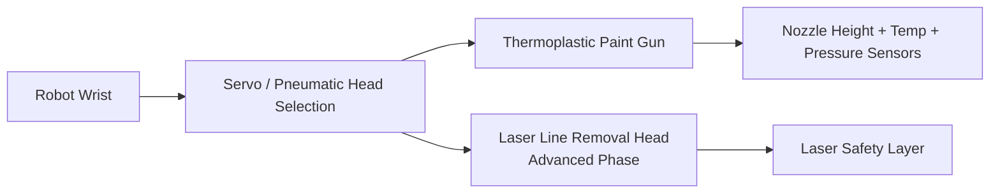

# 5. Robot Kol + X/Y Kızak

<a href="../08-rmde-software-architecture/">Git: RMDE Yazılım</a><a href="../04-next-generation-thermoplastic-gun/">Git: Termoplastik Tabanca</a><a href="../10-quality-control-system/">Git: Kalite Kontrol</a><a href="../12-prototype-bom/#robotic-application-system">Git: BOM: Robot</a><a href="../software/robot_command_layer.py">Git: Yazılım: robot_command_layer.py</a>

## Sistem Tanımı

Robot kol ve X/Y lineer kızak sistemi, RMDE tarafından üretilen koordinat tabanlı uygulama verisini fiziksel yol çizgisine dönüştürür. Görev yalnızca tabancayı taşımak değil; nozzle yüksekliği, açı, hız, cam küreciği senkronizasyonu ve kalite geri bildirimiyle kapalı çevrim uygulama yapmaktır.

## Ana Fonksiyonlar

- robot kol koordinat düzeltmesi,
- X/Y lineer ray ile uygulama alanının genişletilmesi,
- nozzle yüksekliği kontrolü,
- robot bileğinde termoplastik tabanca taşıma,
- opsiyonel laser line removal gun seçimi,
- RMDE referans noktası komutlarını fiziksel harekete çevirme.

## End-Effector Mimarisi

## RMDE Bağlantısı

Her 50 cm referans noktası şunları taşıyabilir:

- Reference Point ID,
- line type,
- start/end coordinate,
- line width,
- line thickness,
- paint temperature,
- vehicle target speed,
- paint flow target,
- robot target Y/Z/angle.

Robot kontrol katmanı bu bilgileri uygulanabilir hareket komutlarına dönüştürür.

## Sensörler

- laser distance sensor,
- robot joint feedback,
- end-effector position verification sensor,
- tabanca sıcaklık sensörü,
- tabanca basınç sensörü,
- vibration / chassis movement reference,
- camera-based line verification.
