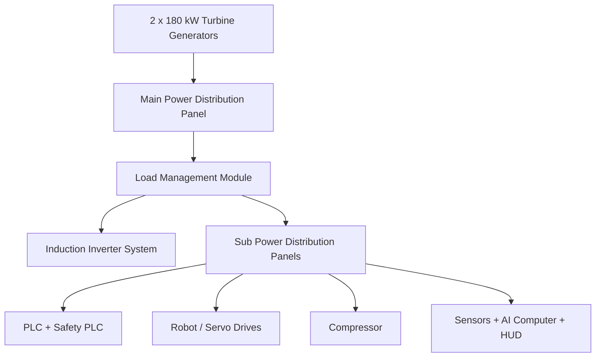

# 6. Güç ve Elektrik Mimarisi

<a href="../03-induction-heating-system/">Git: İndüksiyon Gücü</a><a href="../07-plc-control-system/">Git: PLC Kontrol</a><a href="../12-prototype-bom/#power-generation-and-distribution">Git: BOM: Power</a><a href="../software/plc_process_interface.py">Git: Yazılım: plc_process_interface.py</a>

## Sistem Tanımı

Güç mimarisi, platformu harici şebekeden bağımsız çalışan mobil endüstriyel bir sistem haline getirir. Ana enerji tüketicileri indüksiyon ısıtma, robotik hareket, kompresör, PLC, AI bilgisayarı, sensörler ve kalite kontrol donanımlarıdır.

## Referans Güç Yapısı

| Parametre | Değer |
|---|---|
| Generator type | Turbine-engine high-frequency generator |
| Quantity | 2 |
| Single generator power | 180 kW |
| Total power | 360 kW |
| Output voltage | 400–480 VAC |
| Phase | 3 phase |
| Frequency | 50/60 Hz |
| Connection | Parallel operation via main power bus |

## Enerji Akışı

## Kritik Tasarım Kuralları

- jeneratör çıkışı doğrudan yüke verilmemeli,
- ana pano ve yük yönetimi üzerinden dağıtılmalı,
- indüksiyon yükleri izole edilebilir olmalı,
- PLC ve safety sistemleri en yüksek önceliğe sahip olmalı,
- kablolar vibration-compensated carrier içinde taşınmalı,
- izolasyon kaçağı, aşırı akım ve yangın algılama entegre edilmelidir.

## Jeneratör Yerleşimi

Jeneratörler arka aks grubuna yakın konumlandırılmalı, elastomer titreşim izolatörleri ile şasiye bağlanmalı, sıcak hava çıkışı robot, sensör ve LiDAR görüş alanına yönelmemelidir.
