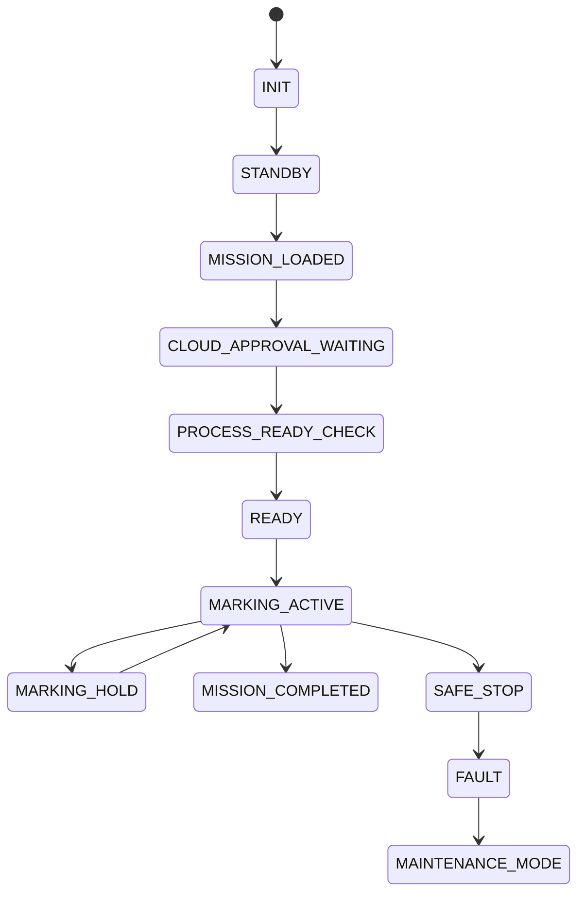

# 7. PLC ve Kontrol Sistemi

<a href="../06-power-electrical-architecture/">Git: Güç Mimarisi</a><a href="../03-induction-heating-system/">Git: İndüksiyon PID</a><a href="../05-robot-arm-xy-rail/">Git: Robot Komutları</a><a href="../software/plc_process_interface.py">Git: Yazılım: plc_process_interface.py</a><a href="../software/safety_supervisor.py">Git: Yazılım: safety_supervisor.py</a>

## Sistem Tanımı

PLC ve kontrol sistemi, fiziksel prosesin gerçek zamanlı yürütülmesini sağlar. AI sistemi karar üretebilir; ancak indüksiyon, pompa, valf, safety, basınç, sıcaklık ve motion katmanları endüstriyel kontrol altyapısı ile yönetilmelidir.

## Kontrol Katmanları

| Katman | Hedef Donanım | Görev |
|---|---|---|
| Core AI | NVIDIA Jetson AGX Orin Industrial | RMDE, vision, karar, HUD, kalite analizi |
| Motion Control | Beckhoff TwinCAT IPC | deterministik hareket ve senkronizasyon |
| Robot Control | KUKA Controller + Beckhoff | robot hedef koordinatları |
| Flow Control | Beckhoff IPC / PLC | screw pump, valf, basınç, debi |
| Induction Heat Control | Beckhoff IPC / PLC | PID, inverter, coil güç kontrolü |
| Safety | Beckhoff Safety PLC | E-stop, safe stop, STO, safety zones |
| HUD/HMI | Jetson + HMI panel | sürücü rehberliği ve operatör ekranı |

## PLC I/O Haritası — Ana Gruplar

- digital inputs,
- digital outputs,
- analog inputs,
- analog outputs,
- safety inputs,
- safety outputs,
- encoder inputs,
- pressure sensors,
- temperature sensors,
- flow sensors,
- servo drive signals,
- valve control outputs,
- inverter command signals,
- emergency stop circuits.

## State Machine

## Safety Prensibi

AI sistemi safety kararını tek başına vermez. Son güvenlik yetkisi Safety PLC üzerinde olmalıdır. AI yalnızca analiz, risk tahmini veya öneri üretebilir.
