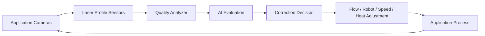

# 10. Kalite Kontrol Sistemi

<a href="../08-rmde-software-architecture/">Git: RMDE Geri Besleme</a><a href="../09-hud-driver-guidance/">Git: HUD Kalite Durumu</a><a href="../software/quality_control_module.py">Git: Yazılım: quality_control_module.py</a><a href="../12-prototype-bom/#sensor-and-ai-integration">Git: BOM: Sensors</a>

## Sistem Tanımı

Kalite kontrol sistemi, çizginin sadece uygulanıp uygulanmadığını değil; doğru genişlikte, doğru kalınlıkta, doğru geometride, doğru cam küreciği dağılımı ve sıcaklık/akış kararlılığı ile uygulanıp uygulanmadığını doğrular.

## Kapalı Çevrim Akış

## Ölçülen Parametreler

- line width accuracy,
- line thickness accuracy,
- geometry / alignment deviation,
- glass bead distribution,
- line continuity,
- vehicle speed stability,
- robot application precision,
- paint temperature stability,
- flow rate stability.

## Hata Kayıt Örneği

| Alan | Örnek |
|---|---|
| Error Type | Line deviation |
| Location | P420 – P438 |
| Deviation Value | 6 cm |
| Recommended Correction | robot calibration / vehicle speed correction |

## Raporlama

Görev sonunda sistem otomatik rapor üretmelidir: ortalama genişlik, kalınlık, hız, kalite skoru, sıcaklık stabilitesi, akış stabilitesi ve tespit edilen hata bölgeleri.
