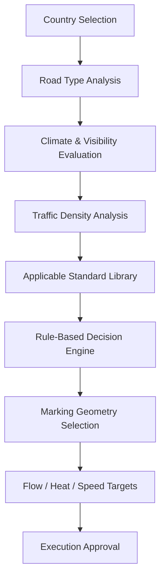

# 11. Uluslararası Standart Motoru

<a href="../08-rmde-software-architecture/">Git: RMDE Karar Motoru</a><a href="../10-quality-control-system/">Git: Kalite Kontrol</a><a href="../12-prototype-bom/#software-and-data-systems">Git: BOM: Standards Data</a><a href="../software/standards_rule_engine.py">Git: Yazılım: standards_rule_engine.py</a>

## Sistem Tanımı

Uluslararası standart motoru, platformun tek bir ülke standardına bağlı kalmadan ülke, yol tipi, iklim, trafik yoğunluğu, asfalt tipi, gece/gündüz görünürlüğü, UV direnci, havalimanı ve endüstriyel tesis senaryolarına göre karar üretmesini sağlar.

## Standart Seçim Akışı

## Senaryo Kütüphanesi

| Senaryo | AI Karar Yaklaşımı |
|---|---|
| Türkiye motorway | 15–20 cm motorway lane standard |
| Türkiye urban road | 3 m / 3 m urban lane structure |
| U.S. two-way road | Yellow centerline approach |
| European urban road | 10–12 cm urban lane standard |
| GCC desert motorway | thick-film, UV-resistant, high-retroreflective marking |
| Canadian winter road | wet-night visibility prioritized edge guidance |
| Scandinavian motorway | snow-resistant high-visibility markings |
| Japanese urban road | precision-geometry urban marking mode |
| South Korea smart city | ITS-compatible high-visibility markings |
| China expressway | high-speed guidance standard |
| Airport taxiway | ICAO / FAA taxiway marking standard |
| Industrial facility | heavy-wear-resistant safety marking |
| AGV / robotic guidance line | high-contrast, machine-readable guide marking |

## Avrupa Notu

Avrupa’da performans standartları ve ülke bazlı geometrik yol çizgi kuralları ayrı değerlendirilmelidir. EN performans standartları görünürlük, retroreflectivity, renk, skid resistance ve test yaklaşımını; geometrik çizgi ölçüleri ise ülke bazlı ulusal düzenlemeleri temsil eder.

## Kritik Mühendislik Yaklaşımı

Bu sistemin amacı “tek global standart” kullanmak değil, ülke + iklim + trafik + operasyon bağlamına göre uyarlanabilir AI destekli standart yönetimi oluşturmaktır.
