# ROMR Engineering Knowledge Platform

<a href="01-system-flow/">Git: Sistem Akışı</a><a href="04-next-generation-thermoplastic-gun/">Git: Termoplastik Tabanca</a><a href="13-software-files/">Git: Yazılım Dosyaları</a><a href="12-prototype-bom/">Git: BOM</a>

Bu platform, beş teknik dokümandaki bilgileri özetlemek için değil; mekanik, proses, elektrik, PLC, yazılım, sensör, kalite kontrol ve uluslararası standart katmanlarını tek bir mühendislik ağı içinde birbirine bağlamak için tasarlanmıştır.

## Ana Sistem Haritası

```mermaid
flowchart LR
    A[Road Survey & Data Acquisition] --> B[Digital Road Model]
    B --> C[RMDE Decision Engine]
    C --> D[50 cm Reference Points]
    D --> E[Robot Arm Commands]
    E --> F[Pellet Paint Feeding]
    F --> G[Multi-Stage Induction Heating]
    G --> H[Next-Generation Rotary Bell / Dual-Disc Paint Gun]
    H --> I[Road Marking Application]
    I --> J[Quality Control & Feedback]
    J --> K[International Standards Validation]
    K --> C
```

## Modül Kartları

<h3>Pellet Boya Sistemi</h3>
Homojen granül boya, tank, karıştırıcı, vida besleme, debi kontrolü ve indüksiyon hattına düzenli malzeme transferi.
<a href="02-pellet-paint-system/">Git: Pellet Sistemi</a>

<h3>İndüksiyon Isıtma</h3>
4 m referans hat, çok kademeli sıcaklık bölgeleri, PID kontrol ve 200–220°C uygulama sıcaklığı yönetimi.
<a href="03-induction-heating-system/">Git: Isıtma Sistemi</a>

<h3>Yeni Nesil Termoplastik Tabanca</h3>
Rotary bell / dual-disc, geniş akış geometrisi, hava destekli stabilizasyon, indüksiyon destekli gövde ısıtması ve otomatik iç temizlik.
<a href="04-next-generation-thermoplastic-gun/">Git: Tabanca</a>

<h3>Robot Kol + X/Y Kızak</h3>
Koordinat tabanlı uygulama, nozzle yüksekliği, robot hedef pozisyonu ve RMDE bağlantısı.
<a href="05-robot-arm-xy-rail/">Git: Robot</a>

<h3>RMDE Yazılım Mimarisi</h3>
Pre-survey, yol sınıflandırma, standart kontrolü, 50 cm referans noktası, robot komutu, HUD ve kalite kontrol.
<a href="08-rmde-software-architecture/">Git: RMDE</a>

<h3>Uluslararası Standart Motoru</h3>
Türkiye, Hindistan, Avrupa, ABD, GCC, Kanada, İskandinavya, Japonya, Güney Kore, Çin, havalimanı ve endüstriyel senaryolar.
<a href="11-international-standards-engine/">Git: Standartlar</a>

## Platform Kullanım Mantığı

Her ana sayfanın üst bölümünde **Git** kısa yol butonları bulunur. Bu butonlar kullanıcıyı doğrudan ilgili ekipman listesine, yazılım dosyasına, PLC sinyallerine, sensör mimarisine, güç mimarisine, standart tablosuna veya kaynak doküman haritasına götürür.
