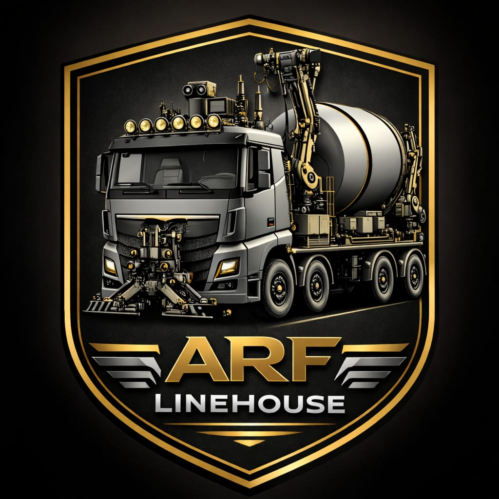
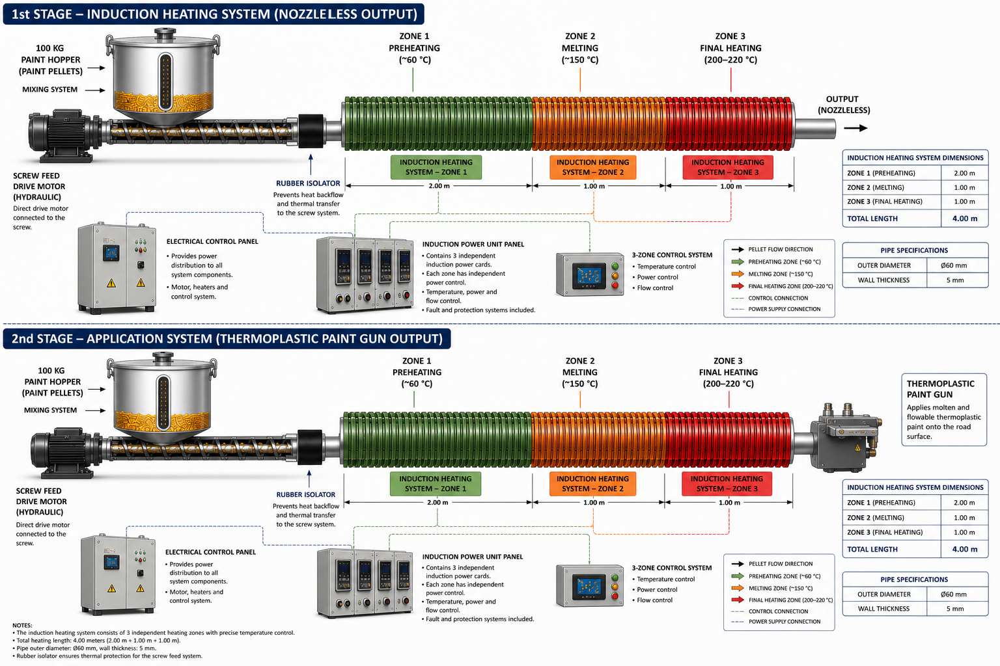

# ROMR Autonomous Road Marking Platform

## AI-Based Thermoplastic Road Marking, Robotic Application and Industrial Automation System

ROMR is an advanced autonomous road marking platform developed under the ARF Linehouse engineering vision.  
The platform combines artificial intelligence, thermoplastic material handling, induction-assisted heating, robotic line application, digital road modelling and industrial control architecture.

[RMDE Software Architecture](08-rmde-software-architecture.md){ .md-button .md-button--primary }
[System Architecture](01-system-flow.md){ .md-button }
[Prototype BOM](12-prototype-bom.md){ .md-button }

---

## Platform Overview

## Prototype Road Marking Vehicle

Mobile industrial platform concept for autonomous and semi-autonomous road marking operations.

---

## Induction Heating Demonstrator

Early-stage demonstrator for controlled thermal processing and heating architecture validation.

---

## Core Technologies

- Artificial Intelligence
- Thermoplastic Material Processing
- Induction Heating
- Robotic Application System
- PLC Control System
- RMDE Software Architecture
- Quality Control System
- International Standards Engine

---

## Software Access

[Open RMDE Software](08-rmde-software-architecture.md){ .md-button .md-button--primary }

[View System Map](01-system-flow.md){ .md-button }

[Open Prototype BOM](12-prototype-bom.md){ .md-button }

---

# Engineering Documentation

## System Architecture

- [01 System Flow](01-system-flow.md)
- [02 Pellet Paint System](02-pellet-paint-system.md)
- [03 Induction Heating System](03-induction-heating-system.md)

## Industrial Rotary Bell Spray Technology

- [04 Next Generation Thermoplastic Gun](04-next-generation-thermoplastic-gun.md)

## Robotic Application Platform

- [05 Robot Arm and XY Rail System](05-robot-arm-xy-rail.md)

## Power and Control Systems

- [06 Power Electrical Architecture](06-power-electrical-architecture.md)
- [07 PLC Control System](07-plc-control-system.md)

## Software Platform

- [08 RMDE Software Architecture](08-rmde-software-architecture.md)
- [09 HUD Driver Guidance](09-hud-driver-guidance.md)

## Quality Assurance

- [10 Quality Control System](10-quality-control-system.md)

## International Standards

- [11 International Standards Engine](11-international-standards-engine.md)

## Prototype Documentation

- [12 Prototype BOM](12-prototype-bom.md)
- [13 Software Files](13-software-files.md)
- [14 Source Document Map](14-source-document-map.md)
